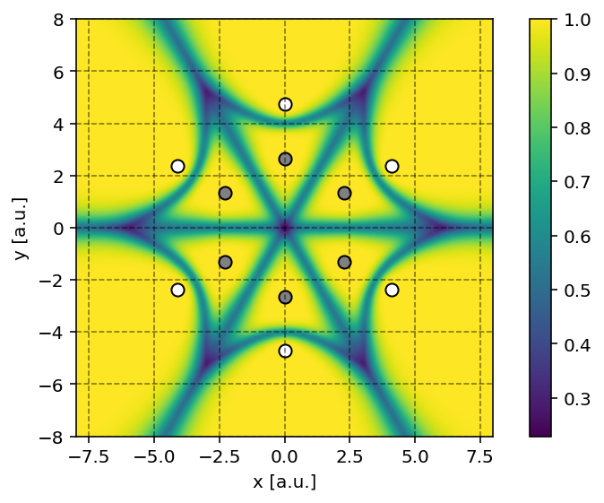
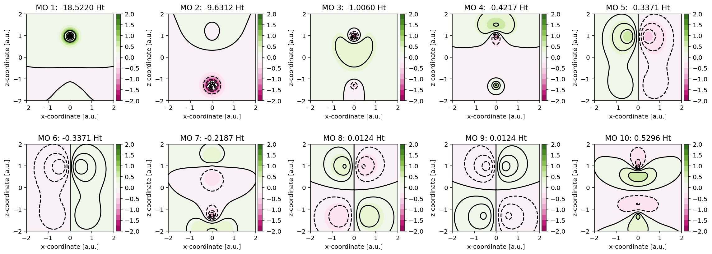

# PyDFT

[](https://github.com/ifilot/pydft/actions/workflows/build_pypi.yml)
[](https://codecov.io/gh/ifilot/pydft)
[](https://pypi.org/project/pydft/)
[](https://www.gnu.org/licenses/gpl-3.0)

> [!NOTE]  
> Python based Density Functional Theory code for educational purposes. The
> documentation of PyDFT can be found [here](https://ifilot.github.io/pydft/).

## Purpose

PyDFT is a pure-Python package for performing localized-orbital Density
Functional Theory (DFT) calculations using Gaussian Type Orbitals. It implements
restricted Kohn-Sham DFT for closed-shell molecules and currently supports the
LDA and PBE exchange-correlation functionals.

The goal of PyDFT is not to be the fastest DFT code, but to be the most
**transparent** one. It is designed first and foremost as an educational tool
that reveals how a DFT calculation is actually assembled, from numerical grids
and electron densities to potentials, matrix elements, and the self-consistent
field procedure. Every intermediate quantity is exposed to the user and can be
inspected, plotted, or modified, and considerable effort was put into
documenting the code. PyDFT is not intended for professional calculations and
does not offer the speed or breadth of features of mature open-source or
commercial packages; what it offers instead is a clear, modifiable view into a
working DFT code.

The figure below gives a high-level overview of a complete PyDFT calculation:
from molecular input and dependencies, through construction of the Becke grid
and one-electron matrices, to the Kohn-Sham SCF iteration and the wide range of
quantities exposed for inspection.


> [!TIP]  
> Interested in other **educational** quantum chemical codes? Have a look at the
> packages below.
> * [PyQInt](https://github.com/ifilot/pyqint) is a hybrid C++/Python (Cython)
>   code for performing Hartree-Fock calculations. This code contains many
>   relevant features, such a geometry optimization, orbital localization and
>   crystal orbital hamilton population analysis.
> * [HFCXX](https://github.com/ifilot/hfcxx) is a full C++ code for performing
>   Hartree-Fock calculations.
> * [DFTCXX](https://github.com/ifilot/dftcxx) is a full C++ code for performing
>   Density Functional Theory Calculations.

## Features

The sections below highlight a few of the capabilities that make PyDFT useful
as a teaching and exploration tool.

### Numerical integration using Becke grids

Electron-electron interaction terms (both classical as well as
exchange-correlation) are performed by means of extensive numerical integration
schemes performed over so-called Becke grids. Utilizing these grids, molecular
integrals are decomposed into series of weighted atomic integrals.



### Molecular orbital visualization

PyDFT can be readily used alongside [matplotlib](https://matplotlib.org/stable/)
to make figures of molecular orbitals or density fields.



### Extensive output

Internal matrices, e.g. overlap or Hamiltonian matrix, are exposed to the user
and can be readily visualized using specific matrix visualization routines.


### Tunable numerical settings

Numerical choices that are usually hidden behind defaults in production codes,
such as the radial and angular resolution of the grid, the spherical-harmonic
expansion used for the Hartree potential, the exchange-correlation functional,
and the SCF convergence criteria, are all exposed directly. This makes it
straightforward to study how each setting affects accuracy, stability, and
computational cost.

## Installation

This code depends on a few other packages. To install this code and its
dependencies, run the following one-liner

```bash
pip install pydft pyqint pylebedev pytessel
```

## Usage

### Check the current version

```python
import pydft
print(pydft.__version__)
```

### Performing a simple calculation

```python
from pydft import MoleculeBuilder, DFT

CO = MoleculeBuilder().get_molecule("CO")
dft = DFT(CO, basis='sto3g')
res = dft.scf(1e-4, verbose=True)
print("Total electronic energy: %f Ht" % res['energy'])
```

## Community guidelines

* Contributions to PyDFT are always welcome and appreciated. Before doing so,
  please first read the [CONTRIBUTING](CONTRIBUTING.md) guide.
* For reporting issues or problems with the software, you are kindly invited to
  to open a [new issue with the bug
  label](https://github.com/ifilot/pydft/issues/new?labels=bug).
* If you seek support in using PyDFT, please [open an issue with the
  question](https://github.com/ifilot/pydft/issues/new?labels=question) label.
* If you wish to contact the developers, please send an e-mail to ivo@ivofilot.nl.

## License

Unless otherwise stated, all code in this repository is provided under the GNU
General Public License version 3.
