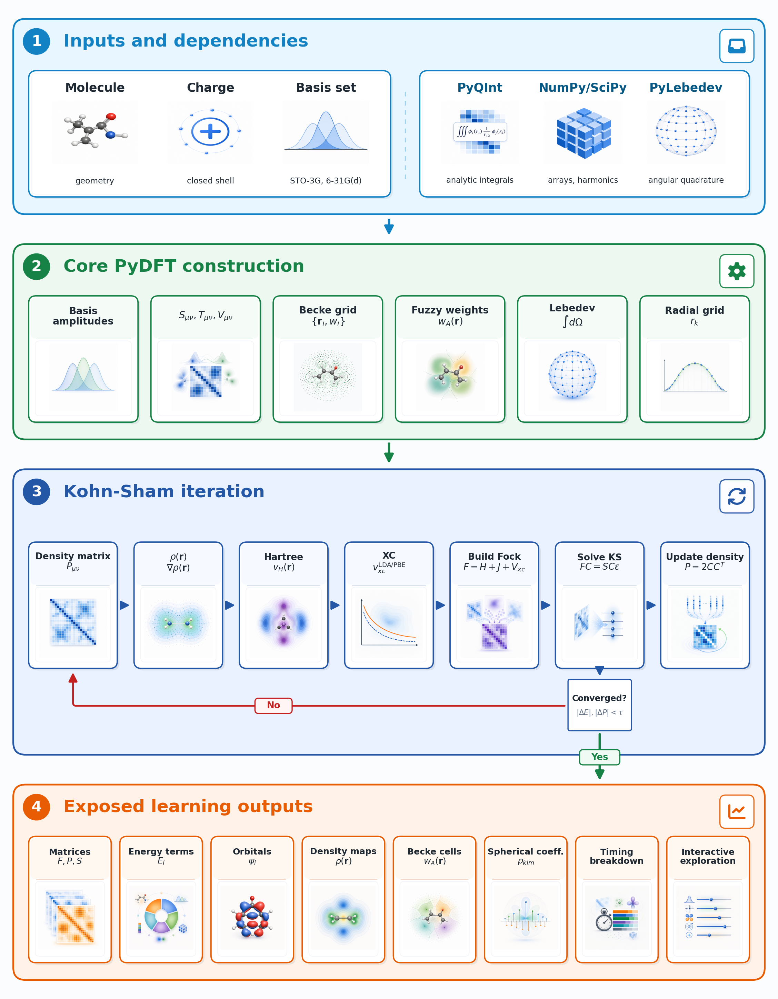

.. index:: Background

Background
==========

.. contents:: Table of Contents
    :depth: 3

:program:`PyDFT` is a pure-Python package for performing Density Functional
Theory (DFT) calculations. It builds on top of
`PyQInt <https://pyqint.imc-tue.nl/>`_, which handles the underlying
quantum-chemical integrals, and draws on
`PyLebedev <https://github.com/ifilot/pylebedev>`_ for numerical integration
on the unit sphere and `PyTessel <https://pytessel.imc-tue.nl/>`_ for
generating isosurfaces of molecular orbitals.

The goal of :program:`PyDFT` is not to be the fastest DFT code, but to be
the most transparent one. Every intermediate quantity, including the molecular
grid, the electron density, the Hartree and exchange-correlation potentials,
the matrix elements, and the orbital energies, is accessible and can be
inspected, plotted, or modified. This makes it well suited for learning how a
DFT calculation is actually assembled.

.. tip::

   A detailed explanation of the theory behind :program:`PyDFT` can be found in
   the textbook "Elements of Electronic Structure Theory" (chapter 4), which is
   freely available `via this website <https://ifilot.pages.tue.nl/elements-of-electronic-structure-theory/>`_.

Overview of the PyDFT workflow
-------------------------------

The figure below gives a bird's-eye view of a complete :program:`PyDFT`
calculation. It is divided into four stages that mirror the sections of this
page.

   High-level overview of the PyDFT workflow. Molecular input, charge, and
   basis-set information are combined with PyQInt, NumPy, and PyLebedev to
   construct the numerical objects required by PyDFT. The package then builds
   atom-centered Becke grids, evaluates densities and potentials, iterates the
   restricted Kohn-Sham equations to self-consistency, and exposes intermediate
   matrices, fields, orbitals, energy components, and timing data for
   educational inspection.

#. **Inputs and dependencies.** The user provides a molecular geometry, a
   charge (which determines whether the system is neutral or ionic), and a
   choice of Gaussian basis set. PyQInt takes these and computes all the
   one-electron integrals needed to build the Hamiltonian. PyLebedev provides
   the angular quadrature points on the unit sphere that are used later to
   build the numerical grid.
#. **Core PyDFT construction.** :program:`PyDFT` evaluates the basis-function
   amplitudes at every grid point, assembles the one-electron matrices
   (overlap :math:`\mathbf{S}`, kinetic energy :math:`\mathbf{T}`, nuclear
   attraction :math:`\mathbf{V}`), and constructs the atom-centered Becke grid
   together with the fuzzy-cell weights.
#. **Kohn-Sham iteration.** The core of the calculation is a self-consistent
   field (SCF) loop: starting from an initial guess for the electron density,
   :program:`PyDFT` builds the Fock matrix, solves the Kohn-Sham equations for
   new orbitals, and updates the density. This repeats until the density no
   longer changes appreciably between cycles.
#. **Exposed learning outputs.** Once converged, the full range of quantities
   is available for inspection: matrices, energy terms, orbitals, density maps,
   Becke cells, spherical-harmonic coefficients, timing data, and more.

From molecule to basis set
--------------------------

Every DFT calculation starts with a description of the molecule: the nuclear
positions, the atomic numbers, and the total charge. From these, a *basis
set* is chosen, that is, a collection of Gaussian-type functions (GTOs)
centred on the atoms. These functions serve as the building blocks with which the
electronic wave function will be approximated; a larger basis set gives a
more flexible description of the electrons but also makes the calculation
more expensive.

:program:`PyDFT` delegates all basis-set and integral work to PyQInt. It
computes the three one-electron matrices that appear in any quantum-chemical
method:

* the **overlap matrix** :math:`\mathbf{S}`, which measures how much each
  pair of basis functions overlaps in space;
* the **kinetic-energy matrix** :math:`\mathbf{T}`, which encodes the
  kinetic energy of electrons moving through the basis;
* the **nuclear-attraction matrix** :math:`\mathbf{V}`, which describes the
  attraction of the electrons to the nuclei.

Together these form the one-electron Hamiltonian
:math:`\mathbf{H}^{\text{core}} = \mathbf{T} + \mathbf{V}`, which is the
starting point for the Kohn-Sham procedure.

Molecular decomposition and numerical grid
------------------------------------------

A DFT calculation requires evaluating many integrals over three-dimensional
space, for example to compute the electron density or the energy. These
integrals are almost never solved analytically; instead, :program:`PyDFT`
uses numerical integration, also called *quadrature*.

The key idea is to break the molecule apart into a set of overlapping,
atom-centered regions, often called *fuzzy cells*. Each atom gets its own
region of space, and the boundaries between regions are kept deliberately
smooth so that nothing is double-counted. This approach, introduced by Becke
:cite:p:`becke:1988:multicenter`, turns one difficult molecular integral into a
sum of simpler atom-by-atom integrals.

:program:`PyDFT` builds a grid around each atom using two components: a
*radial* Gauss-Chebyshev grid that samples distances from the nucleus, and
an *angular* Lebedev grid :cite:p:`lebedev:1976` that samples directions on a
sphere. The Becke partitioning then assigns a smooth weight to each grid
point, indicating how much that point "belongs" to a given atom. Because the
weights sum to one everywhere, the full molecular integral is recovered
exactly as a weighted sum over all atomic grids. In the code, the
molecular-level grid is managed by :class:`pydft.MolecularGrid` and the
per-atom grids by :class:`pydft.AtomicGrid`.

The Kohn-Sham self-consistent field loop
-----------------------------------------

The central idea of Kohn-Sham DFT :cite:p:`kohn:1965` is to replace the
interacting many-electron problem with an equivalent system of
non-interacting electrons that produce the same ground-state electron
density. These fictitious non-interacting electrons move in an effective
potential, the *Kohn-Sham potential*, which combines the external potential
of the nuclei, the classical electron-electron repulsion (the Hartree term),
and a correction for all quantum-mechanical many-body effects (the
exchange-correlation term).

Because the Kohn-Sham potential itself depends on the electron density, and
the density depends on the orbitals, and the orbitals depend on the
potential, the problem must be solved *self-consistently*. In practice this
means running an iterative loop:

1. **Initialize.** Start with an initial guess for the electron density
   :math:`\rho`, typically built from a superposition of atomic densities.
2. **Build the Kohn-Sham (Fock) matrix** :math:`\mathbf{F}`. This involves
   computing the Hartree potential :math:`V_H[\rho]` and the
   exchange-correlation potential :math:`V_{xc}[\rho]` on the numerical grid
   and integrating them with pairs of basis functions.
3. **Solve the Kohn-Sham equations** :math:`\mathbf{FC} = \mathbf{SC}\mathbf{\varepsilon}`.
   This is a generalized eigenvalue problem whose solutions are the orbital
   coefficient matrix :math:`\mathbf{C}` and the orbital energies
   :math:`\varepsilon`.
4. **Update the density matrix**
   :math:`\mathbf{P} = 2\mathbf{C}_{\text{occ}}\mathbf{C}_{\text{occ}}^T`,
   where the factor of 2 accounts for spin in a closed-shell system.
5. **Check convergence.** If the density has changed by less than a
   threshold between cycles, the calculation is finished. Otherwise, return
   to step 2 with the new density (optionally mixed with the old density to
   help convergence).

:program:`PyDFT` supports density mixing and DIIS (Direct Inversion of the
Iterative Subspace) :cite:p:`pulay:1980` to accelerate and stabilize
convergence. Once the loop has converged, the total electronic energy is
assembled from kinetic, nuclear-attraction, Hartree, and
exchange-correlation contributions.

Hartree potential
-----------------

When electrons repel one another, each electron feels an electrostatic
potential created by the charge distribution of all the other electrons. This
is called the *Hartree potential*, and computing it accurately is one of the
more challenging steps in a DFT calculation.

:program:`PyDFT` obtains the Hartree potential by solving *Poisson's equation*,
the classical equation that relates a charge distribution to the
electrostatic potential it produces. Following the method of Becke and Dickson
:cite:p:`becke:1988:poisson`, this is done separately for each fuzzy cell,
which keeps the problem tractable.

The procedure works in stages that are easy to follow: the electron density in
each atomic cell is first expanded in terms of real spherical harmonics (think
of these as angular "shape functions" on a sphere). Poisson's equation is then
solved independently for each angular channel, giving a set of radial
Hartree-potential coefficients. These coefficients are interpolated back onto
the full molecular grid, and the result is integrated with pairs of basis
functions to assemble the Coulomb matrix :math:`\mathbf{J}`.

Exchange-correlation functions
------------------------------

In DFT, the exchange-correlation functional captures quantum-mechanical
effects, most importantly the fact that electrons of the same spin avoid each
other (exchange) and that electron motion is correlated. This part of the
energy cannot be computed exactly and must be approximated.

:program:`PyDFT` currently supports two widely-used approximations:

* **LDA** (Local Density Approximation): combines Slater exchange
  :cite:p:`slater:1951` with the SVWN5 correlation functional
  :cite:p:`vosko:1980`. The energy density at each point depends only on the
  local electron density :math:`\rho` at that point. This is the simplest
  meaningful approximation and a good starting point for learning DFT.
* **PBE** (Perdew-Burke-Ernzerhof): a Generalised Gradient Approximation (GGA)
  functional :cite:p:`pbe:1996`. It improves on LDA by also taking into account
  how the density varies spatially through the gradient invariant
  :math:`\sigma = |\nabla\rho|^2`. This extra information makes PBE more
  accurate for most molecules, at a modest additional cost.

Both functionals are evaluated on the numerical molecular grid. For PBE,
:program:`PyDFT` also caches the basis-function gradients needed to evaluate
:math:`\sigma` and adds the corresponding GGA contribution to the
exchange-correlation matrix.

What you can inspect
---------------------

A key design goal of :program:`PyDFT` is that intermediate quantities are
not hidden. After a converged calculation, the following objects are directly
accessible through the Python interface:

* **Matrices**: the overlap, kinetic-energy, nuclear-attraction, Hartree,
  exchange-correlation, and full Kohn-Sham (Fock) matrices.
* **Energy decomposition**: the total energy broken into its kinetic,
  nuclear-attraction, Hartree, and exchange-correlation components.
* **Orbitals and orbital energies**: the coefficient matrix :math:`\mathbf{C}`
  and the Kohn-Sham eigenvalues :math:`\varepsilon_i`.
* **Density fields**: the electron density :math:`\rho(\mathbf{r})` and, for
  GGA calculations, its gradient :math:`|\nabla\rho|` on the molecular grid.
* **Becke cells and weights**: the fuzzy-cell decomposition of the molecule,
  useful for visualizing the grid and understanding numerical integration.
* **Hartree and XC potentials**: the potentials as scalar fields on the grid.
* **Spherical-harmonic coefficients**: the expansion of the density used
  inside the Hartree solver.
* **Timing data**: per-step wall times, useful for understanding where
  computation time is spent as grid resolution is varied.

The tutorials in this documentation walk through each of these in detail,
with code examples and visualizations.
