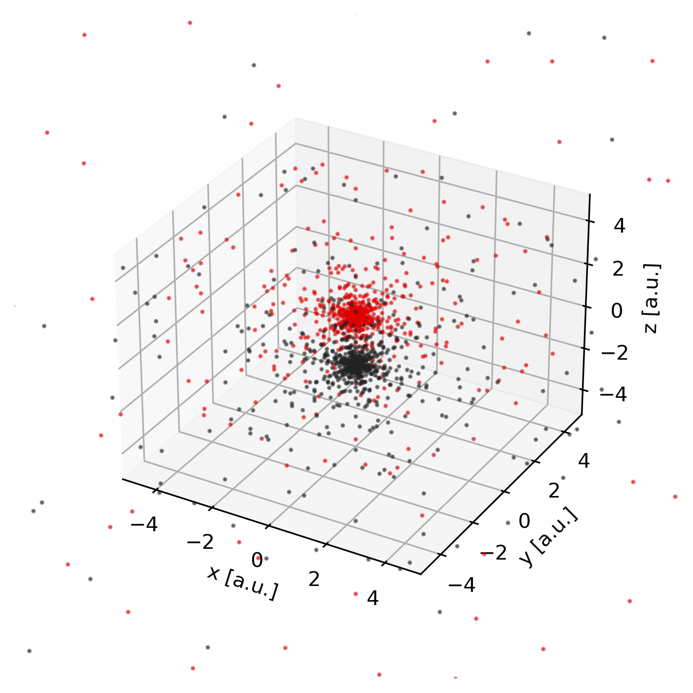

Becke grid analysis
===================

.. contents:: Table of Contents
    :depth: 3

All numerical integrations are performed by means of Gauss-Chebychev and Lebedev
quadrature using the Becke grid. The radial Gauss-Chebychev points describe the
distance from an atomic center, while the Lebedev points describe directions on
the unit sphere. Their tensor product gives an atom-centered grid.

For molecules, these atom-centered grids overlap. Becke weights turn the overlap
into a smooth partition of unity: each grid point receives one weight per atom,
and the weights at that point sum to one. Integrals over the whole molecule can
therefore be evaluated as a weighted sum of atomic-grid contributions.

Atomic fuzzy cells
------------------

It is possible to produce a contour plot of
the fuzzy cells (molecular weights) on a plane using the
:meth:`pydft.MolecularGrid.calculate_weights_at_points` method. An example 
is provided below.

.. literalinclude:: scripts/06-becke-grid.py
	:language: python
	:linenos:
	:emphasize-lines: 22

In the script above, we color every point by the maximum value for each of the
atomic weights. When this maximum value is one, this implies that the grid point
belongs to a single atom. When multiple atoms 'share' a grid point, the maximum
value among the atomic weights will be lower than one.

.. image:: _static/img/user_interface/06-becke-grid.png

.. note::

	Producing such a contour plot is only meaningful for planar molecules such
	as benzene. For more complex molecules such as methane, it is rather
	difficult to make sense of the fuzzy cells upon projection on a plane.

Grid points
-----------

To obtain the set of grid points on which the numerical integration (quadrature),
is performed, we can invoke the :meth:`pydft.MolecularGrid.get_grid_coordinates`
method.

.. literalinclude:: scripts/06-grid-points.py
	:language: python
	:linenos:
	:emphasize-lines: 14

