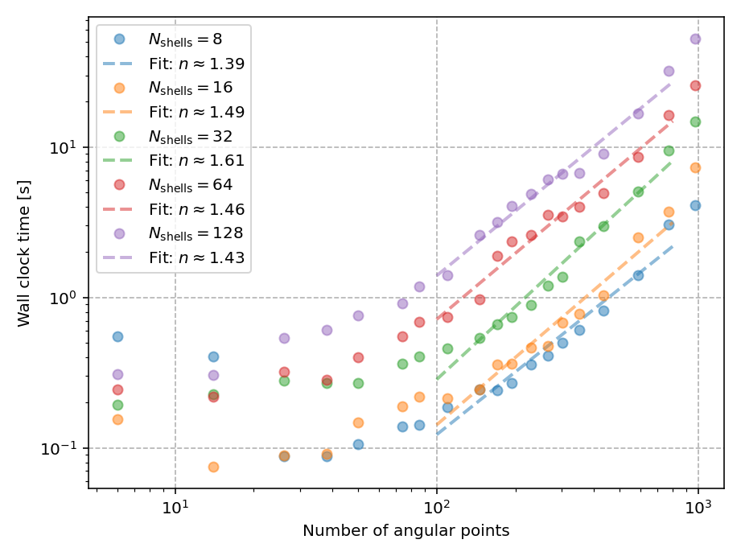
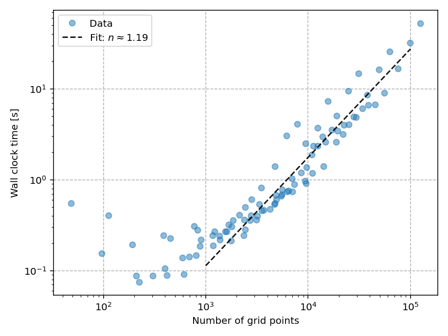
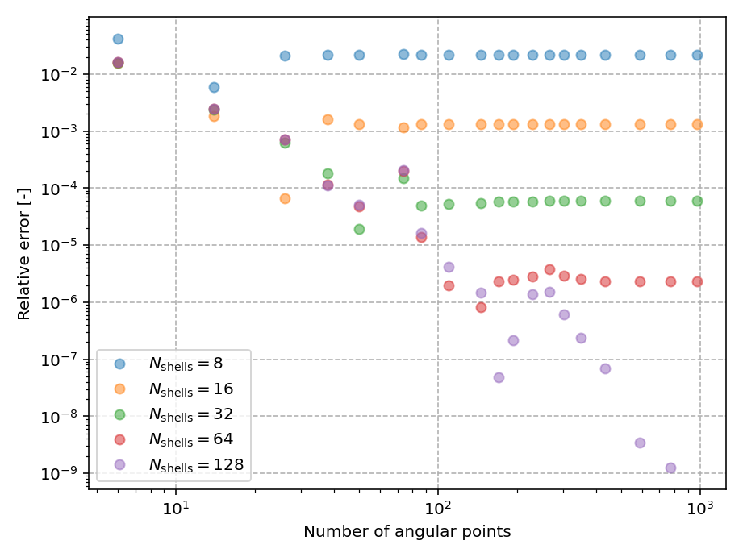

.. index:: benchmarks

Benchmarks
==========

.. contents:: Table of Contents
    :depth: 3

To probe the performance of :program:`PyDFT`, we performed a number of scaling
tests, which are shown below. All scaling tests were executed on a workstation
equipped with an Intel(R) Core(TM) i9-10900K CPU @ 3.70 GHz. The reported
timings therefore reflect the performance of :program:`PyDFT` on this specific
hardware configuration.

Execution times
---------------

The observed scaling behavior of :program:`PyDFT` follows a clear power-law
trend. When varying the number of angular grid points, the computational cost
scales approximately as :math:`N_\mathrm{ang}^{1.5}`. In contrast, scaling with
respect to the total number of grid points yields a lower exponent of about
:math:`N_\mathrm{grid}^{1.2}`. This behavior is consistent with a near-linear
scaling in the radial grid size combined with a superlinear (approximately
1.5-power) scaling in the number of angular points.

    Scaling of the wall-clock time with respect to the number of angular points.

    Scaling of the wall-clock time with respect to the total number of grid
    points, which is the product of the number of radial shells times the 
    number of angular grid points.

Energy
------

The figure below shows the relative error as a function of the number of radial
shells and angular grid points. A clear systematic trend is observed: beyond a
certain threshold, increasing the number of angular points no longer leads to
a significant reduction in the relative error. This saturation occurs at
approximately 200 angular points, indicating that a value of about 230 angular
points is sufficient in practice.

With respect to the radial grid, a favorable balance between computational cost
and accuracy is obtained when using 32 radial shells, which already results in
a relative error below :math:`1 \times 10^{-4}`. For higher accuracy
requirements, increasing the number of radial shells to 64 further reduces the
error to approximately :math:`1 \times 10^{-6}`.

    Relative error as function of the number of radial shells and the number
    of angular points.
