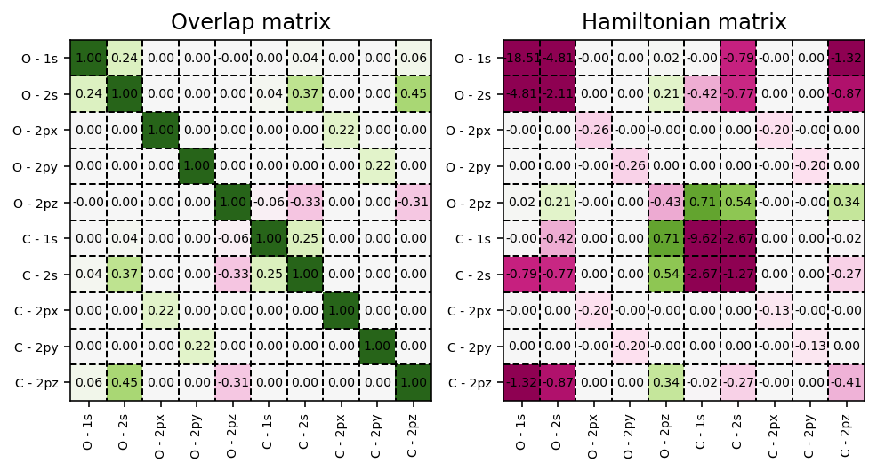

.. index:: electronic_structure_calculations

Electronic Structure Calculations
=================================

.. contents:: Table of Contents
    :depth: 3

To start, we perform a high-level calculation of the electronic structure
of the carbon-monoxide molecule using the default SVWN5 exchange-correlation
functional :cite:p:`slater:1951,vosko:1980`.
To perform this calculation, we first have to construct a
:class:`pydft.DFT` object which requires a molecule as its input. Next, we use
the :meth:`pydft.DFT.scf` routine to start the self-consistent field calculation.

.. literalinclude:: scripts/00-start.py
    :language: python
    :linenos:

Performing this calculation shows that the total electronic energy for this
system corresponds to::

    Total electronic energy:      -111.130470 Ht

Result dictionary
-----------------

The result of an SCF calculation is captured in a Python dictionary object.
This dictionary contains all quantities required to analyze, post-process,
and validate the electronic structure calculation. The data layout is shared
between PyDFT and PyQInt to ensure a consistent interface across methods.

The most commonly used key is :code:`energy`, which stores the final converged
total energy. Other entries expose the objects that appear in the SCF equations:
the density matrix :math:`\mathbf{P}`, the one-electron matrices
:math:`\mathbf{S}`, :math:`\mathbf{T}`, and :math:`\mathbf{V}`, the Hartree
matrix :math:`\mathbf{J}`, and the exchange-correlation matrix. This is why
examples usually store the SCF result as :code:`res` and then access quantities
such as :code:`res['energy']` or :code:`res['density']`.

.. list-table:: Description of the data contained in the result dictionary
   :class: tight-table
   :widths: 25 75
   :header-rows: 1

   * - Key
     - Description
   * - :code:`energy`
     - Final converged total electronic energy (Hartree).
   * - :code:`energies`
     - Total electronic energy at each SCF iteration.
   * - :code:`ekin`
     - Electronic kinetic energy,
       :math:`\mathrm{Tr}(\mathbf{T}\mathbf{P})`.
   * - :code:`enuc`
     - Electron-nuclear attraction energy,
       :math:`\mathrm{Tr}(\mathbf{V}\mathbf{P})`.
   * - :code:`erepe`
     - Electron-electron Coulomb (Hartree) energy,
       :math:`\mathrm{Tr}(\mathbf{J}\mathbf{P})`.
   * - :code:`enucrep`
     - Nuclear-nuclear repulsion energy.
   * - :code:`ex`
     - Exchange energy (Hartree-Fock or DFT).
   * - :code:`ec`
     - Correlation energy (DFT only).
   * - :code:`exc`
     - Total exchange-correlation energy.
   * - :code:`orbe`
     - Molecular orbital eigenvalues (orbital energies).
   * - :code:`orbc`
     - Molecular orbital coefficient matrix (AO basis).
   * - :code:`density`
     - One-particle density matrix :math:`\mathbf{P}`.
   * - :code:`fock`
     - Fock matrix :math:`\mathbf{F}`.
   * - :code:`hartree`
     - Hartree (Coulomb) matrix :math:`\mathbf{J}`.
   * - :code:`xc`
     - Exchange-correlation matrix (DFT only, ``None`` for HF).
   * - :code:`overlap`
     - Overlap matrix :math:`\mathbf{S}`.
   * - :code:`kinetic`
     - Kinetic energy matrix :math:`\mathbf{T}`.
   * - :code:`nuclear`
     - Nuclear attraction matrix :math:`\mathbf{V}`.
   * - :code:`hcore`
     - Core Hamiltonian matrix
       :math:`\mathbf{H}_\mathrm{core} = \mathbf{T} + \mathbf{V}`.
   * - :code:`mol`
     - Molecular object defining atoms, geometry, and charge.
   * - :code:`nuclei`
     - Nuclear positions and charges.
   * - :code:`cgfs`
     - List of contracted Gaussian basis functions.
   * - :code:`nelec`
     - Total number of electrons.
   * - :code:`time_stats`
     - Dictionary containing timing information for construction and
       SCF iterations.

Energy decomposition
--------------------

The molecular matrices can be used to perform a so-called energy decomposition,
i.e., decompose the total electronic energy into the kinetic, nuclear attraction,
electron-electron repulsion and exchange-correlation energy.

.. literalinclude:: scripts/03-energy-decomposition.py
	:language: python
	:linenos:

The above script yields the following output::

  Total electronic energy:      -111.130470 Ht

  Kinetic energy:                110.217226 Ht
  Nuclear attraction:           -304.930911 Ht
  Electron-electron repulsion:    75.612987 Ht
  Exchange energy:               -12.055233 Ht
  Correlation energy:             -1.232632 Ht
  Exchange-correlation energy:   -13.287865 Ht
  Nucleus-nucleus repulsion:      21.258092 Ht

  Sum:  -111.130470 Ht

Self-consistent field matrices
------------------------------

To visualize the overlap matrix :math:`\mathbf{S}` and the Fock matrix
:math:`\mathbf{F}`, we can use the script as found below.

.. literalinclude:: scripts/03-matrices.py
    :language: python
    :linenos:
    :emphasize-lines: 18,19

   Overlap and Hamiltonian matrices exposed by the SCF result dictionary.

Showing the electronic steps
----------------------------

To get verbose output, i.e. information per electronic step, configure
``logging`` and specify :code:`verbose = True`.

.. note::

   PyDFT uses Python's standard ``logging`` module for these progress messages
   instead of printing directly. This means that :code:`verbose = True` tells
   PyDFT to create informational log messages, while
   :code:`logging.basicConfig(...)` tells Python where and how to show them.
   Without the ``logging`` configuration, the calculation still runs normally,
   but the progress messages remain hidden. This makes it possible to use PyDFT
   quietly in scripts, tests, and notebooks, or to send messages to the terminal
   when interactive feedback is useful.

.. literalinclude:: scripts/00-verbose.py
    :language: python
    :linenos:

Executing the script above yields output like the following. The timings depend
on the machine and runtime environment::

	001 | E =  -179.237419 | dE = 0.0000e+00 | 0.0010 s
	002 | E =  -106.662588 | dE = 0.0000e+00 | 1.2765 s
	003 | E =  -117.641796 | dE = 7.2575e+01 | 0.0172 s
	004 | E =  -107.190988 | dE = 1.0979e+01 | 0.0201 s
	005 | E =  -117.376118 | dE = 1.0451e+01 | 0.0203 s
	006 | E =  -117.085797 | dE = 1.0185e+01 | 0.0160 s
	007 | E =  -108.013652 | dE = 2.9032e-01 | 0.0149 s
	008 | E =  -107.421366 | dE = 9.0721e+00 | 0.0143 s
	009 | E =  -110.457951 | dE = 5.9229e-01 | 0.0151 s
	010 | E =  -110.419024 | dE = 3.0366e+00 | 0.0176 s
	011 | E =  -109.548780 | dE = 3.8927e-02 | 0.0159 s
	012 | E =  -111.008079 | dE = 8.7024e-01 | 0.0159 s
	013 | E =  -111.118875 | dE = 1.4593e+00 | 0.0163 s
	014 | E =  -111.130700 | dE = 1.1080e-01 | 0.0162 s
	015 | E =  -111.130454 | dE = 1.1825e-02 | 0.0210 s
	016 | E =  -111.130470 | dE = 2.4610e-04 | 0.0258 s
	017 | E =  -111.130470 | dE = 1.6288e-05 | 0.0188 s
	018 | E =  -111.130470 | dE = 9.2335e-08 | 0.0158 s
	Stopping SCF cycle, convergence reached.

Each line corresponds to one update of the density matrix. Internally, PyDFT
uses the current density matrix to build the electron density on the molecular
grid, constructs the Hartree and exchange-correlation matrices, forms the
Kohn-Sham/Fock matrix, diagonalizes it, and then builds the next density matrix
from the occupied orbitals. The energy difference :code:`dE` is the convergence
measure used by :meth:`pydft.DFT.scf`.

Different exchange-correlation functionals
------------------------------------------

To use a different exchange-correlation functional, pass the ``functional``
argument when constructing the :class:`pydft.DFT` object:

.. literalinclude:: scripts/00-xc.py
    :language: python
    :linenos:

which yields the following total electronic energies for the :code:`SVWN5` and
:code:`PBE` :cite:p:`pbe:1996` exchange-correlation functions::

    SVWN:  -111.13047044798054 Ht
    PBE:  -111.64036457334683 Ht

Tuning the numerical accuracy
-----------------------------

The numerical accuracy of an electronic structure calculation in
:program:`PyDFT` can be controlled through the specification of the radial and
angular integration grids. These grids are defined per atomic species and can be
adjusted by the user when constructing the :class:`pydft.DFT` object.

The radial grid is controlled via the number of radial shells
(:code:`nshells`), while the angular resolution is controlled via the number of
angular points (:code:`nangpts`). Both parameters are provided as mappings from
element symbols to integer values. Increasing either parameter generally
improves the accuracy of the numerical integration at the cost of increased
computational effort.

The angular grid in :program:`PyDFT` is based on Lebedev quadrature. As a
consequence, the number of angular points must correspond to one of the
predefined Lebedev grid sizes :cite:p:`lebedev:1976`. Arbitrary values for
:code:`nangpts` are not permitted; only the fixed values listed below are valid.

The supported numbers of angular points are:

.. code-block:: text

     6, 14, 26, 38, 50, 74, 86, 110, 146, 170, 194, 230,
     266, 302, 350, 434, 590, 770, 974, 1202, 1454, 1730,
     2030, 2354, 2702, 3074, 3470, 3890, 4334, 4802,
     5294, 5810

By default, :program:`PyDFT` uses 20, 25, and 30 radial shells for first-, 
second-, and third-row atoms, respectively. For the angular grid, 110 angular
points are used for all atoms, except for hydrogen, for which 50 angular points
are used. The maximum angular momentum quantum number :code:`lmax` is determined
automatically from the chosen number of angular points; for the default values,
this corresponds to :code:`lmax = 8` for 110 angular points and
:code:`lmax = 5` for 50 angular points.

Users may override these defaults by explicitly specifying :code:`nshells` and
:code:`nangpts` when constructing the :class:`pydft.DFT` object. For example, a
calculation with a moderately accurate grid can be set up as

.. literalinclude:: scripts/00-set-r-ang.py
    :language: python
    :linenos: 
    :emphasize-lines: 6,7

which shows the following output::

    Total electronic energy:      -111.142418 Ht

If higher accuracy is required, the number of radial shells can be increased,
for example to 64, and the number of angular points can be increased by
selecting a larger Lebedev grid from the list above. In practice, we observe
that increasing the number of angular points beyond a certain threshold does
not lead to significant further improvements in accuracy, whereas increasing
the number of radial shells continues to systematically reduce the error.

By adjusting :code:`nshells` and selecting an appropriate Lebedev grid via
:code:`nangpts`, users can balance computational cost and numerical accuracy
according to the requirements of their specific application.
