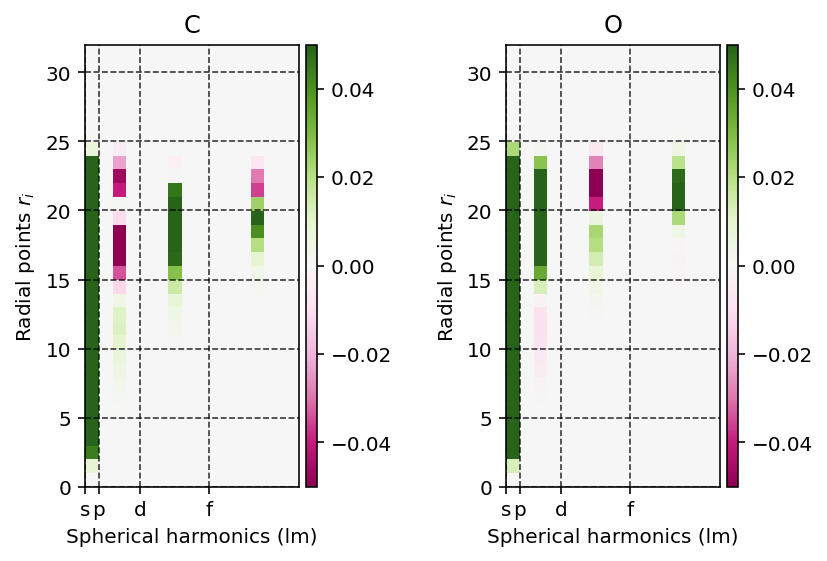

.. index:: hartree_potential_analysis

Hartree potential analysis
==========================

.. contents:: Table of Contents
    :depth: 3

The Hartree potential is calculated from the electron density distribution
using the Poisson equation. 

Projection onto spherical harmonics
-----------------------------------

The Poisson equation is solved on the **atomic grid** by first projecting 
the electron density onto the spherical harmonics such that the following
equation holds.

.. math::

	\rho(r_{k}, \Omega) = \sum_{lm} \rho_{klm} Y_{lm}

where :math:`\rho(r_{k}, \Omega)` is the electron density at radius
:math:`r_{k}`, :math:`\rho_{klm}` the linear expansion coefficient at position
:math:`r_{k}` for the spherical harmonic :math:`lm` and :math:`Y_{lm}` a
spherical harmonic with quantum numbers :math:`l` and :math:`m`.

We can readily visualize and interpret this projection using the
:meth:`pydft.MolecularGrid.get_rho_lm_atoms` as shown by the script below.

.. literalinclude:: scripts/07-spherical-harmonics-projection.py
	:language: python
	:linenos:
	:emphasize-lines: 13

