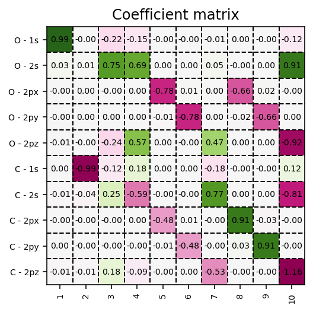

.. index:: orbital_visualization

Orbital Visualization
=====================

.. contents:: Table of Contents
    :depth: 3

Within the Kohn-Sham approximation, the set of molecular orbitals that minimizes
the total electronic energy are found via the diagonalization of the Fock
matrix. 

Coefficient matrix
------------------

These Kohn-Sham orbitals are encoded in the coefficient matrix which
is extracted via the script below.

.. literalinclude:: scripts/04-kohn-sham-orbitals.py
    :language: python
    :linenos:

   Molecular-orbital coefficient matrix in the atomic-orbital basis.

Contour plots
-------------

These orbitals can be readily visualized, as exemplified in the code below. Here,
we make use of the :meth:`pydft.MolecularGrid.get_amplitude_at_points` method.
To use this method, we first have to retrieve the :class:`pydft.MolecularGrid`
object from the :class:`pydft.DFT` class via its :meth:`pydft.DFT.get_molgrid_copy`
method.

.. literalinclude:: scripts/05-orbital-contour-plot.py
    :language: python
    :linenos:
    :emphasize-lines: 37

.. figure:: _static/img/user_interface/05-orbital-contour-plot.png
   :width: 95%

   Contour plots for the Kohn-Sham molecular orbitals of CO.

.. seealso::
	
	To get a better impression of the three-dimensional shape of the molecular
	orbitals, it is recommended to produce isosurfaces rather than contour 
	plots.

Isosurfaces
-----------

Generating an isosurface is very similar to generating a contour plot, but with
the notable difference that the orbital has to be sampled in three-dimensional
space. In the script below, an example is provided for one of the :math:`1\pi`
orbitals of CO. Observe that for generating an isosurface, the algorithm has to
be executed twice, once for the positive lobe and once for the negative lobe.
The isosurfaces are stored in so-called `Polygon File Format
<https://en.wikipedia.org/wiki/PLY_(file_format)>`_ files which can be used in
your favorite rendering program.

.. note::
    Isosurface generation requires the :program:`PyTessel` package to be
    installed. More information can be found `here <https://pytessel.imc-tue.nl>`_.

.. literalinclude:: scripts/05-isosurfaces.py
    :language: python
    :linenos:
