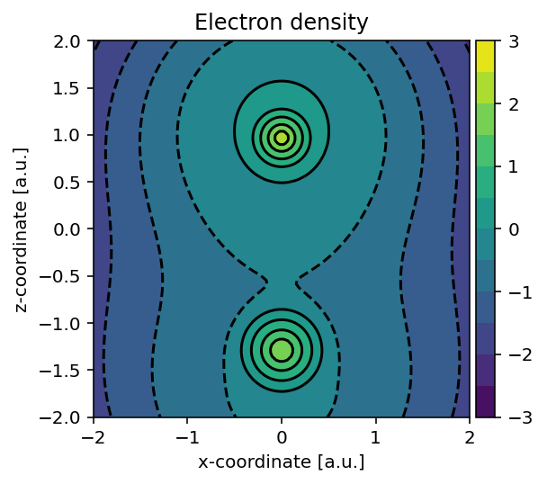
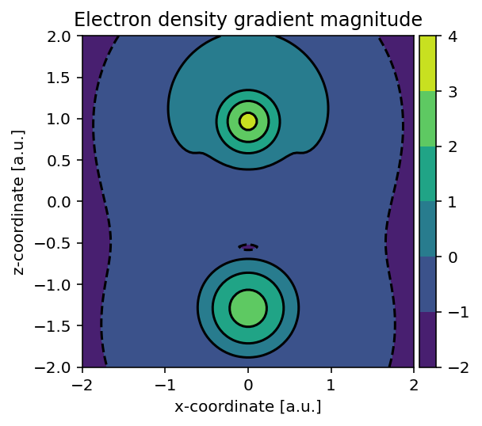
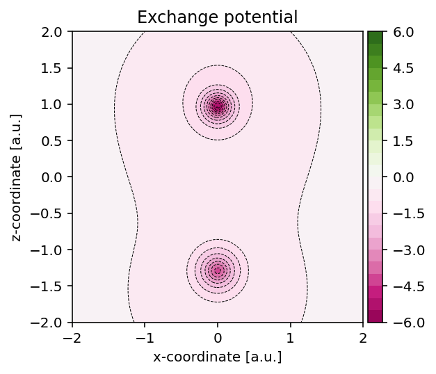
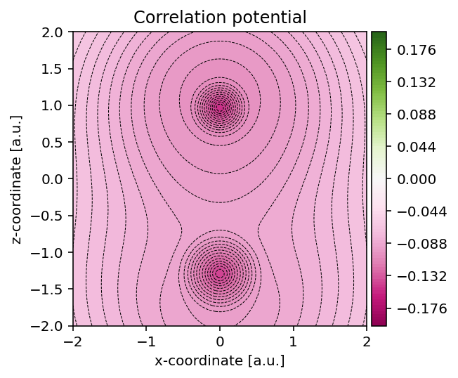

Scalar field analysis
=====================

.. contents:: Table of Contents
    :depth: 3

Once the electronic structure has been determined, a variety of scalar fields
derived from the electron density can be analyzed and visualized. These fields
provide insight into the spatial distribution of electronic properties and form
the basis for interpreting exchange, correlation, and density-related
quantities.

Electron density and its gradient
---------------------------------

The :class:`pydft.DFT` class exposes its internal matrices and a number of
useful functions which we can readily use to interpret its operation. Let us
start by generating a plot of the electron density using the method
:meth:`pydft.DFT.get_density_at_points`.

.. literalinclude:: scripts/01-electron-density.py
    :language: python
    :linenos:
    :emphasize-lines: 25

Running the above script yields the electron density.

Using largely the same code, we can also readily build the electron density
gradient magnitude using :meth:`pydft.DFT.get_gradient_at_points`.

.. literalinclude:: scripts/02-electron-density-gradient.py
    :language: python
    :linenos:
    :emphasize-lines: 25

Exchange potential
------------------

To construct the exchange potential at arbitrary grid points, we can use the
script as shown below which uses the :meth:`pydft.MolecularGrid.get_exchange_potential_at_points`
method.

.. literalinclude:: scripts/08-exchange-potential.py
	:language: python
	:linenos:
	:emphasize-lines: 13

Correlation potential
---------------------

In a similar fashion as for the exchange potential, we can use the method
:meth:`pydft.MolecularGrid.get_correlation_potential_at_points` to obtain the
correlation potential field.

.. literalinclude:: scripts/08-correlation-potential.py
	:language: python
	:linenos:
	:emphasize-lines: 13

