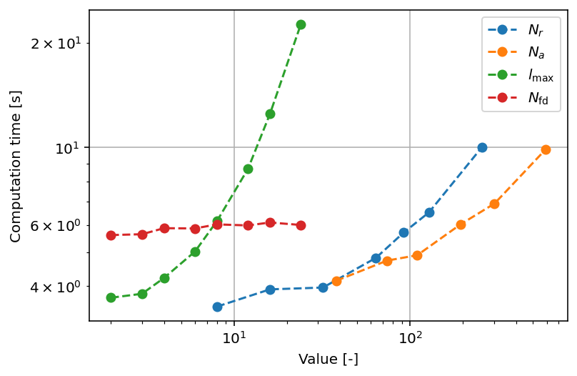

.. _user_interface:
.. index:: userinterface

User Interface
==============

:program:`PyDFT` is an educational pure-Python module to perform simple density
functional theory (DFT) calculations using a Gaussian basis set. Uniquely, 
:program:`PyDFT` exposes many routines that are normally hidden from the user,
which are potentially interesting for the user to understand how a DFT calculations
is performed. We will provide a demonstration here.

.. note::

    Every code snippet listed below can be run stand-alone. This does imply
    that every code snippet re-performed the initial self-consistent field
    calculation. If that is undesirable, the reader is invited to copy
    the relevant parts of the code (highlighted) and place these in a single
    file.

Building molecules
------------------

Molecules can be built either directly using the :code:`Molecule` class or via
a :code:`MoleculeBuilder` convenience routine. 

.. important::

	The :code:`Molecule` and :code:`MoleculeBuilder` classes are not implemented
	in :program:`PyDFT` but are obtained from the :program:`PyQInt` module.

Molecule class
##############

To manually build a molecule, one first need to construct a :code:`Molecule`
object after which one or more atoms can be assigned to the molecule. If no
:code:`unit` is specified, it is assumed that all coordinates are given in
atomic units (i.e. Bohr units).

.. code-block:: python
	:linenos:

	from pyqint import Molecule

	mol = Molecule('co')
	mol.add_atom('C', 0.0, 0.0, 0.0, unit='angstrom')
	mol.add_atom('O', 0.0, 0.0, 1.2, unit='angstrom')

MoleculeBuilder class
#####################

Alternatively, a Molecule can be constructed from the :code:`MoleculeBuilder` 
class which uses a name. For more information about the :code:`MoleculeBuilder` 
class, please consult the
`PyQInt documentation on the MoleculeBuilder class <https://pyqint.imc-tue.nl/user_interface.html#using-the-moleculebuilder-class>`_.

.. code-block:: python
	:linenos:

	from pyqint import Molecule

	co = MoleculeBuilder().from_name("CO")

Calculating electronic energy
-----------------------------

To start, we perform a high-level calculation of the electronic structure
of the carbon-monoxide molecule using the PBE exchange-correlation functional.
To perform this calculation, we first have to construct a
:class:`pydft.DFT` object which requires a molecule as its input. Next, we use
the :meth:`pydft.DFT.scf` routine to start the self-consistent field calculation.

.. literalinclude:: scripts/00-start.py
    :language: python
    :linenos:

Performing this calculation shows that the total electronic energy for this
system corresponds to::

    Total electronic energy:      -111.147096 Ht

Showing the electronic steps
############################

.. literalinclude:: scripts/00-verbose.py
    :language: python
    :linenos:

Executing the script above yields the following output::

	001 | E =  -179.237380 | dE = 0.0000e+00 | 0.0010 s
	002 | E =  -106.678953 | dE = 0.0000e+00 | 0.0810 s
	003 | E =  -117.660767 | dE = 7.2558e+01 | 0.0670 s
	004 | E =  -107.204261 | dE = 1.0982e+01 | 0.0660 s
	005 | E =  -117.396119 | dE = 1.0457e+01 | 0.0610 s
	006 | E =  -117.080704 | dE = 1.0192e+01 | 0.0690 s
	007 | E =  -108.040074 | dE = 3.1541e-01 | 0.0580 s
	008 | E =  -107.453445 | dE = 9.0406e+00 | 0.0620 s
	009 | E =  -110.504979 | dE = 5.8663e-01 | 0.0710 s
	010 | E =  -110.484364 | dE = 3.0515e+00 | 0.0680 s
	011 | E =  -109.605523 | dE = 2.0615e-02 | 0.0680 s
	012 | E =  -111.037173 | dE = 8.7884e-01 | 0.0630 s
	013 | E =  -111.136251 | dE = 1.4317e+00 | 0.0710 s
	014 | E =  -111.147174 | dE = 9.9078e-02 | 0.0730 s
	015 | E =  -111.146826 | dE = 1.0923e-02 | 0.0660 s
	016 | E =  -111.146838 | dE = 3.4816e-04 | 0.0720 s
	017 | E =  -111.146838 | dE = 1.2150e-05 | 0.0660 s
	018 | E =  -111.146838 | dE = 8.0277e-08 | 0.0660 s
	Stopping SCF cycle, convergence reached.

Different exchange-correlation functionals
##########################################

To use a different exchange-correlation functional, we can use the 

.. literalinclude:: scripts/00-xc.py
    :language: python
    :linenos:

which yields the following total electronic energies for the :code:`SVWN5` and
:code:`PBE` exchange-correlation functions::

	SVWN:  -111.14709591483225 Ht
	PBE:  -111.65660426438342 Ht

Electron density and its gradient
---------------------------------

The :class:`pydft.DFT` class exposes its internal matrices and a number of
useful functions which we can readily use to interpret its operation. Let us
start by generating a plot of the electron density using the method
:meth:`pydft.DFT.get_density_at_points`.

.. literalinclude:: scripts/01-electron-density.py
    :language: python
    :linenos:
    :emphasize-lines: 25

Running the above script yields the electron density.

.. figure:: _static/img/user_interface/01-electron-density.png

Using largely the same code, we can also readily build the electron density
gradient magnitude using :meth:`pydft.DFT.get_gradient_at_points`.

.. literalinclude:: scripts/02-electron-density-gradient.py
    :language: python
    :linenos:
    :emphasize-lines: 25

.. figure:: _static/img/user_interface/02-electron-density-gradient.png

Adjusting grid and discretization schemes
-----------------------------------------

By default, PyDFT uses 32 radial grid points and 110 angular grid points per
atom. To calculate the Hartree potential, the electron density is projected onto
spherical harmonics with a maximum angular momentum of :math:`l_{\text{max}} =
8`. The finite-difference discretization scheme used to solve the Poisson
equation uses 7 adjacent points. All these settings can be adjusted to
potentially reduce computational time or to increase upon the accuracy. In the
following subsections, this is explored in more detail. In the graph below, a
visual summary of the scaling of the parameters in terms of computing time is
provided.

Number of radial shells
#######################

In the listing below, the scaling with respect to the number of radial shells is
shown. It can be readily seen that there are no more significant changes in the
total electronic energy after :math:`N_{r} = 64`. On the basis of these results,
it can be found that the computation time scales with :math:`t \propto N_{r}^{0.3725}`.

.. list-table::
   :header-rows: 1

   * - :math:`N_{r}`
     - Energy [Ht]
     - Computation Time (s)
   * - 8
     - -114.0908
     - 3.4304
   * - 16
     - -111.0566
     - 3.6955
   * - 32
     - -111.1468
     - 4.1970
   * - 64
     - -111.1495
     - 4.9463
   * - 92
     - -111.1495
     - 5.5899
   * - 128
     - -111.1495
     - 6.5389
   * - 256
     - -111.1495
     - 10.0511

Number of angular grid points
#############################

:program:`PyDFT` uses by default 110 angular points per spherical shell. From
the listing below, it can be seen that this yields decent accuracy in terms of
energy, though the accuracy can be improved a bit further by using 194 or more
angular points. On the basis of these results, it can be found that the
computation time scales with :math:`t\propto N_{r}^{0.3344}`.

.. list-table::
   :header-rows: 1

   * - :math:`N_{a}`
     - Energy
     - Computation Time (s)
   * - 38
     - -111.1226
     - 4.1232
   * - 74
     - -111.1698
     - 4.8680
   * - 110
     - -111.1495
     - 5.4705
   * - 194
     - -111.1503
     - 6.3094
   * - 302
     - -111.1503
     - 7.0128
   * - 590
     - -111.1503
     - 10.1610

Maximum angular momentum
########################

For the calculation of the Hartree potential, the electron density is projected
per radial shell onto spherical harmonics. The highest angular momentum used for
the projection is determined by the :code:`lmax` parameter, which by default is
set to :math:`l_{\text{max}} =8`. Increasing this value further shows some
irregularities in terms of the energy, which are assigned to increased numerical
noise in the linear expansion coefficients used in the expansion scheme. The
total number of spherical harmonics used scales with :math:`N_{\text{sh}}
\propto l_{\text{max}}^{2}`, hence we see somewhat steeper scaling in terms of
computational time for this parameter. On the basis of these results, it can be
found that the computation time scales with :math:`t\propto
l_{\text{max}}^{1.064}`.

It is relevant to mention that the original paper of Becke mentions that the
ideal value for :math:`l_{\text{max}} \approx l_{\text{quad}}/2` which yields
:math:`l_{\text{max}}` values of 5, 8, 11 and 14 for 50, 110, 194 and 302
angular points.

.. list-table::
   :header-rows: 1

   * - :math:`l_{\text{max}}`
     - Energy
     - Computation Time (s)
   * - 2
     - -111.0728
     - 3.7725
   * - 3
     - -111.1175
     - 4.0743
   * - 4
     - -111.1412
     - 4.4981
   * - 6
     - -111.1511
     - 4.9934
   * - 8
     - -111.1503
     - 6.0379
   * - 12
     - -111.1489
     - 8.5445
   * - 16
     - -111.1489
     - 12.2454
   * - 24
     - -111.0209
     - 22.8109

Number discretization points
############################

When calculating the Hartree potential, a second-order differential equation is
solved for all spherical shells and for each spherical harmonic. This
second-order differential equation is solved using a finite-difference
approximation. For this finite-difference approximation, the number of points
used to establish the first- and second-order derivatives can be set. In the
following analysis, we examine the total electronic energy and computation time
as functions of the number of discretization points. It is evident that beyond 7
discretization points, the total electronic energy remains unchanged. This is
because the coefficients associated with points farther from the point of
interest—where the derivative is calculated—become increasingly smaller.
Consequently, the contribution of distant points diminishes rapidly, rendering
expansions to a higher number of discretization points inefficient.
Additionally, we observe minimal variation in computation time, which can be
attributed to the exceptional efficiency of solving linear matrix equations. As
a result, this aspect is not a significant computational bottleneck in the code.

.. list-table::
   :header-rows: 1

   * - :math:`N_{\text{fd}}`
     - Energy
     - Computation Time (s)
   * - 3
     - -111.1028
     - 5.8947
   * - 5
     - -111.1501
     - 5.7674
   * - 7
     - -111.1503
     - 6.3035
   * - 9
     - -111.1503
     - 5.9776
   * - 11
     - -111.1503
     - 5.8185
   * - 13
     - -111.1503
     - 5.7800
   * - 15
     - -111.1503
     - 5.8533
   * - 17
     - -111.1503
     - 5.8799

Reproducing analysis
####################

To reproduce the analysis, one can use the script as found below.

.. literalinclude:: scripts/09-parameter-scaling.py
    :language: python
    :linenos:

Self-consistent field matrices
------------------------------

To obtain any of the matrices used in the self-consistent field procedure,
we can invoke the :meth:`pydft.DFT.get_data` method. For example, to visualize
the overlap matrix :math:`\mathbf{S}` and the Fock matrix 
:math:`\mathbf{F}`, we can use the script as found below.

.. literalinclude:: scripts/03-matrices.py
    :language: python
    :linenos:
    :emphasize-lines: 18,19

.. figure:: _static/img/user_interface/03-matrices.png

Energy decomposition
####################

The molecular matrices can be used to perform a so-called energy decomposition,
i.e., decompose the total electronic energy into the kinetic, nuclear attraction,
electron-electron repulsion and exchange-correlation energy.

.. literalinclude:: scripts/03-energy-decomposition.py
	:language: python
	:linenos:

The above script yields the following output::

	Total electronic energy:      -111.147096 Ht

	Kinetic energy:                110.216045 Ht
	Nuclear attraction:           -304.930390 Ht
	Electron-electron repulsion:    75.597401 Ht
	Exchange energy:               -12.055579 Ht
	Correlation energy:             -1.232665 Ht
	Exchange-correlation energy:   -13.288244 Ht
	Nucleus-nucleus repulsion:      21.258092 Ht

	Sum:  -111.147096 Ht

Kohn-Sham orbitals and their visualization
------------------------------------------

Within the Kohn-Sham approximation, the set of molecular orbitals that minimizes
the total electronic energy are found via the diagonalization of the Fock
matrix. 

Coefficient matrix
##################

These Kohn-Sham orbitals are encoded in the coefficient matrix which
is extracted via the script below.

.. literalinclude:: scripts/04-kohn-sham-orbitals.py
    :language: python
    :linenos:

.. figure:: _static/img/user_interface/04-kohn-sham-orbitals.png

Contour plots
#############

These orbitals can be readily visualized, as exemplified in the code below. Here,
we make use of the :meth:`pydft.MolecularGrid.get_amplitude_at_points` method.
To use this method, we first have to retrieve the :class:`pydft.MolecularGrid`
object from the :class:`pydft.DFT` class via its :meth:`pydft.get_molgrid_copy`
method.

.. literalinclude:: scripts/05-orbital-contour-plot.py
    :language: python
    :linenos:
    :emphasize-lines: 37

.. figure:: _static/img/user_interface/05-orbital-contour-plot.png

.. seealso::
	
	To get a better impression of the three-dimensional shape of the molecular
	orbitals, it is recommended to produce isosurfaces rather than contour 
	plots.

Isosurfaces
###########

Generating an isosurface is very similar to generating a contour plot, but with
the notable difference that the orbital has to be sampled in three-dimensional
space. In the script below, an example is provided for one of the :math:`1\pi`
orbitals of CO. Observe that for generating an isosurface, the algorithm has to
be executed twice, once for the positive lobe and once for the negative lobe.
The isosurfaces are stored in so-called `Polygon File Format
<https://en.wikipedia.org/wiki/PLY_(file_format)>`_ files which can be used in
your favorite rendering program.

.. note::
    Isosurface generation requires the :program:`PyTessel` package to be
    installed. More information can be found `here <https://pytessel.imc-tue.nl>`_.

.. literalinclude:: scripts/05-isosurfaces.py
    :language: python
    :linenos:

Analyzing the Becke grid
------------------------

All numerical integrations are performed by means of Gauss-Chebychev and Lebedev
quadrature using the Becke grid. 

Atomic fuzzy cells
##################

It is possible to produce a contour plot of
the fuzzy cells (molecular weights) on a plane using the
:meth:`pydft.MolecularGrid.calculate_weights_at_points` method. An example 
is provided below.

.. literalinclude:: scripts/06-becke-grid.py
	:language: python
	:linenos:
	:emphasize-lines: 22

In the script above, we color every point by the maximum value for each of the
atomic weights. When this maximum value is one, this implies that the grid point
belongs to a single atom. When multiple atoms 'share' a grid point, the maximum
value among the atomic weights will be lower than one.

.. image:: _static/img/user_interface/06-becke-grid.png

.. note::

	Producing such a contour plot is only meaningful for planar molecules such
	as benzene. For more complex molecules such as methane, it is rather
	difficult to make sense of the fuzzy cells upon projection on a plane.

Grid points
###########

To obtain the set of grid points on which the numerical integration (quadrature),
is performed, we can invoke the :meth:`pydft.MolecularGrid.get_grid_coordinates`
method.

.. literalinclude:: scripts/06-grid-points.py
	:language: python
	:linenos:
	:emphasize-lines: 14

.. image:: _static/img/user_interface/06-grid-points.png

Hartree potential
-----------------

The Hartree potential is calculated from the electron density distribution
using the Poisson equation. 

Projection onto spherical harmonics
###################################

The Poisson equation is solved on the **atomic grid** by first projecting 
the electron density onto the spherical harmonics such that the following
equation holds.

.. math::

	\rho(r_{k}, \Omega) = \sum_{lm} \rho_{klm} Y_{lm}

where :math:`\rho(r_{k}, \Omega)` is the electron density at radius
:math:`r_{k}`, :math:`\rho_{klm}` the linear expansion coefficient at position
:math:`r_{k}` for the spherical harmonic :math:`lm` and :math:`Y_{lm}` a
spherical harmonic with quantum numbers :math:`l` and :math:`m`.

We can readily visualize and interpret this projection using the
:meth:`pydft.MolecularGrid.get_rho_lm_atoms` as shown by the script below.

.. literalinclude:: scripts/07-spherical-harmonics-projection.py
	:language: python
	:linenos:
	:emphasize-lines: 13

.. image:: _static/img/user_interface/07-spherical-harmonics-projection.png

Exchange-correlation functional
-------------------------------

The exchange and correlation potentials depend on the electron density and once
the latter has been established, we can readily visualize these potentials.

Visualizing exchange potential
##############################

To construct the exchange potential at arbitrary grid points, we can use the
script as shown below which uses the :meth:`pydft.MolecularGrid.get_exchange_potential_at_points`
method.

.. literalinclude:: scripts/08-exchange-potential.py
	:language: python
	:linenos:
	:emphasize-lines: 13

.. image:: _static/img/user_interface/08-exchange-potential.png

Visualizing correlation potential
#################################

In a similar fashion as for the exchange potential, we can use the method
:meth:`pydft.MolecularGrid.get_correlation_potential_at_points` to obtain the
correlation potential field.

.. literalinclude:: scripts/08-correlation-potential.py
	:language: python
	:linenos:
	:emphasize-lines: 13

.. image:: _static/img/user_interface/08-correlation-potential.png