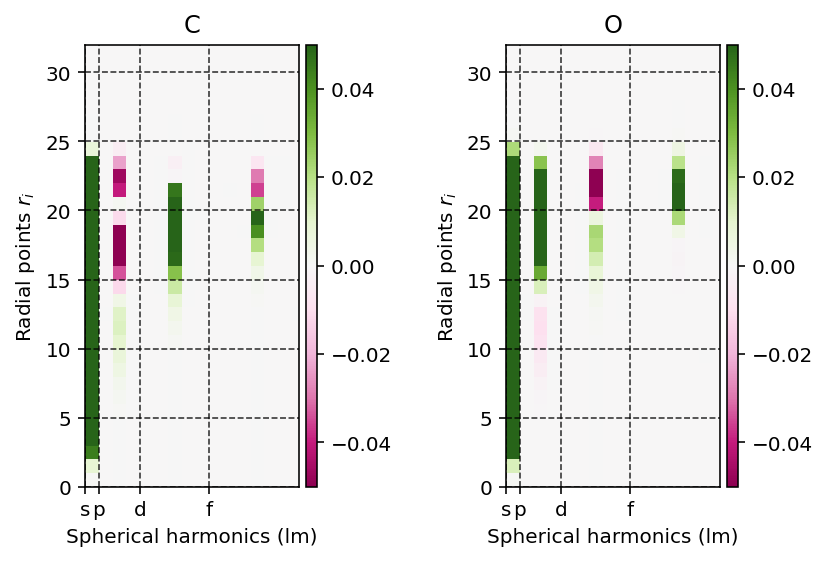

.. _user_interface:
.. index:: userinterface

User Interface
==============

:program:`PyDFT` is an educational pure-Python module to perform simple density
functional theory (DFT) calculations using a Gaussian basis set. Uniquely, 
:program:`PyDFT` exposes many routines that are normally hidden from the user,
which are potentially interesting for the user to understand how a DFT calculations
is performed. We will provide a demonstration here.

.. note::

    Every code snippet listed below can be run stand-alone. This does imply
    that every code snippet re-performed the initial self-consistent field
    calculation. If that is undesirable, the reader is invited to copy
    the relevant parts of the code (highlighted) and place these in a single
    file.

Building molecules
------------------

Molecules can be built either directly using the :code:`Molecule` class or via
a :code:`MoleculeBuilder` convenience routine. 

.. important::

	The :code:`Molecule` and :code:`MoleculeBuilder` classes are not implemented
	in :program:`PyDFT` but are obtained from the :program:`PyQInt` module.

Molecule class
##############

To manually build a molecule, one first need to construct a :code:`Molecule`
object after which one or more atoms can be assigned to the molecule. If no
:code:`unit` is specified, it is assumed that all coordinates are given in
atomic units (i.e. Bohr units).

.. code-block:: python
	:linenos:

	from pyqint import Molecule

	mol = Molecule('co')
	mol.add_atom('C', 0.0, 0.0, 0.0, unit='angstrom')
	mol.add_atom('O', 0.0, 0.0, 1.2, unit='angstrom')

MoleculeBuilder class
#####################

Alternatively, a Molecule can be constructed from the :code:`MoleculeBuilder` 
class which uses a name. For more information about the :code:`MoleculeBuilder` 
class, please consult the
`PyQInt documentation on the MoleculeBuilder class <https://pyqint.imc-tue.nl/user_interface.html#using-the-moleculebuilder-class>`_.

.. code-block:: python
	:linenos:

	from pyqint import Molecule

	co = MoleculeBuilder().from_name("CO")

Calculating electronic energy
-----------------------------

To start, we perform a high-level calculation of the electronic structure
of the carbon-monoxide molecule using the PBE exchange-correlation functional.
To perform this calculation, we first have to construct a
:class:`pydft.DFT` object which requires a molecule as its input. Next, we use
the :meth:`pydft.DFT.scf` routine to start the self-consistent field calculation.

.. literalinclude:: scripts/00-start.py
    :language: python
    :linenos:

Performing this calculation shows that the total electronic energy for this
system corresponds to::

    Total electronic energy:      -111.147096 Ht

Showing the electronic steps
############################

.. literalinclude:: scripts/00-verbose.py
    :language: python
    :linenos:

Executing the script above yields the following output::

	001 | Energy:  -179.237380 | 0.0020 ms
	002 | Energy:  -117.709405 | 0.1130 ms
	003 | Energy:  -118.058343 | 0.0900 ms
	004 | Energy:  -107.368999 | 0.0860 ms
	005 | Energy:  -117.406523 | 0.0868 ms
	006 | Energy:  -112.897655 | 0.0880 ms
	007 | Energy:  -115.401985 | 0.0870 ms
	008 | Energy:  -107.642758 | 0.0860 ms
	009 | Energy:  -112.323123 | 0.0870 ms
	010 | Energy:  -111.477884 | 0.0860 ms
	011 | Energy:  -111.214223 | 0.0860 ms
	012 | Energy:  -111.139379 | 0.0850 ms
	013 | Energy:  -111.147186 | 0.0860 ms
	014 | Energy:  -111.147098 | 0.0860 ms
	015 | Energy:  -111.147096 | 0.0850 ms
	016 | Energy:  -111.147096 | 0.0895 ms
	017 | Energy:  -111.147096 | 0.0855 ms
	018 | Energy:  -111.147096 | 0.0860 ms
	Stopping SCF cycle, convergence reached.

Different exchange-correlation functionals
##########################################

To use a different exchange-correlation functional, we can use the 

.. literalinclude:: scripts/00-xc.py
    :language: python
    :linenos:

which yields the following total electronic energies for the :code:`SVWN5` and
:code:`PBE` exchange-correlation functions::

	SVWN:  -111.14709591483225 Ht
	PBE:  -111.65660426438342 Ht

Electron density and its gradient
---------------------------------

The :class:`pydft.DFT` class exposes its internal matrices and a number of
useful functions which we can readily use to interpret its operation. Let us
start by generating a plot of the electron density using the method
:meth:`pydft.DFT.get_density_at_points`.

.. literalinclude:: scripts/01-electron-density.py
    :language: python
    :linenos:
    :emphasize-lines: 25

Running the above script yields the electron density.

Using largely the same code, we can also readily build the electron density
gradient magnitude using :meth:`pydft.DFT.get_gradient_at_points`.

.. literalinclude:: scripts/02-electron-density-gradient.py
    :language: python
    :linenos:
    :emphasize-lines: 25

Self-consistent field matrices
------------------------------

To obtain any of the matrices used in the self-consistent field procedure,
we can invoke the :meth:`pydft.DFT.get_data` method. For example, to visualize
the overlap matrix :math:`\mathbf{S}` and the Fock matrix 
:math:`\mathbf{F}`, we can use the script as found below.

.. literalinclude:: scripts/03-matrices.py
    :language: python
    :linenos:
    :emphasize-lines: 18,19

Energy decomposition
####################

The molecular matrices can be used to perform a so-called energy decomposition,
i.e., decompose the total electronic energy into the kinetic, nuclear attraction,
electron-electron repulsion and exchange-correlation energy.

.. literalinclude:: scripts/03-energy-decomposition.py
	:language: python
	:linenos:

The above script yields the following output::

	Total electronic energy:      -111.147096 Ht

	Kinetic energy:                110.216045 Ht
	Nuclear attraction:           -304.930390 Ht
	Electron-electron repulsion:    75.597401 Ht
	Exchange energy:               -12.055579 Ht
	Correlation energy:             -1.232665 Ht
	Exchange-correlation energy:   -13.288244 Ht
	Nucleus-nucleus repulsion:      21.258092 Ht

	Sum:  -111.147096 Ht

Kohn-Sham orbitals and their visualization
------------------------------------------

Within the Kohn-Sham approximation, the set of molecular orbitals that minimizes
the total electronic energy are found via the diagonalization of the Fock
matrix. 

Coefficient matrix
##################

These Kohn-Sham orbitals are encoded in the coefficient matrix which
is extracted via the script below.

.. literalinclude:: scripts/04-kohn-sham-orbitals.py
    :language: python
    :linenos:

Contour plots
#############

These orbitals can be readily visualized, as exemplified in the code below. Here,
we make use of the :meth:`pydft.MolecularGrid.get_amplitude_at_points` method.
To use this method, we first have to retrieve the :class:`pydft.MolecularGrid`
object from the :class:`pydft.DFT` class via its :meth:`pydft.get_molgrid_copy`
method.

.. literalinclude:: scripts/05-orbital-contour-plot.py
    :language: python
    :linenos:
    :emphasize-lines: 37

.. seealso::
	
	To get a better impression of the three-dimensional shape of the molecular
	orbitals, it is recommended to produce isosurfaces rather than contour 
	plots.

Isosurfaces
###########

Build isosurfaces

Analyzing the Becke grid
------------------------

All numerical integrations are performed by means of Gauss-Chebychev and Lebedev
quadrature using the Becke grid. 

Atomic fuzzy cells
##################

It is possible to produce a contour plot of
the fuzzy cells (molecular weights) on a plane using the
:meth:`pydft.MolecularGrid.calculate_weights_at_points` method. An example 
is provided below.

.. literalinclude:: scripts/06-becke-grid.py
	:language: python
	:linenos:
	:emphasize-lines: 22

In the script above, we color every point by the maximum value for each of the
atomic weights. When this maximum value is one, this implies that the grid point
belongs to a single atom. When multiple atoms 'share' a grid point, the maximum
value among the atomic weights will be lower than one.

.. image:: _static/img/user_interface/06-becke-grid.png

.. note::

	Producing such a contour plot is only meaningful for planar molecules such
	as benzene. For more complex molecules such as methane, it is rather
	difficult to make sense of the fuzzy cells upon projection on a plane.

Grid points
###########

To obtain the set of grid points on which the numerical integration (quadrature),
is performed, we can invoke the :meth:`pydft.MolecularGrid.get_grid_coordinates`
method.

.. literalinclude:: scripts/06-grid-points.py
	:language: python
	:linenos:
	:emphasize-lines: 14

Hartree potential
-----------------

The Hartree potential is calculated from the electron density distribution
using the Poisson equation. 

Projection onto spherical harmonics
###################################

The Poisson equation is solved on the **atomic grid** by first projecting 
the electron density onto the spherical harmonics such that the following
equation holds.

.. math::

	\rho(r_{k}, \Omega) = \sum_{lm} \rho_{klm} Y_{lm}

where :math:`\rho(r_{k}, \Omega)` is the electron density at radius
:math:`r_{k}`, :math:`\rho_{klm}` the linear expansion coefficient at position
:math:`r_{k}` for the spherical harmonic :math:`lm` and :math:`Y_{lm}` a
spherical harmonic with quantum numbers :math:`l` and :math:`m`.

We can readily visualize and interpret this projection using the
:meth:`pydft.MolecularGrid.get_rho_lm_atoms` as shown by the script below.

.. literalinclude:: scripts/07-spherical-harmonics-projection.py
	:language: python
	:linenos:
	:emphasize-lines: 13

Exchange-correlation functional
-------------------------------

The exchange and correlation potentials depend on the electron density and once
the latter has been established, we can readily visualize these potentials.

Visualizing exchange potential
##############################

To construct the exchange potential at arbitrary grid points, we can use the
script as shown below which uses the :meth:`pydft.MolecularGrid.get_exchange_potential_at_points`
method.

.. literalinclude:: scripts/08-exchange-potential.py
	:language: python
	:linenos:
	:emphasize-lines: 13

Visualizing correlation potential
#################################

In a similar fashion as for the exchange potential, we can use the method
:meth:`pydft.MolecularGrid.get_correlation_potential_at_points` to obtain the
correlation potential field.

.. literalinclude:: scripts/08-correlation-potential.py
	:language: python
	:linenos:
	:emphasize-lines: 13

